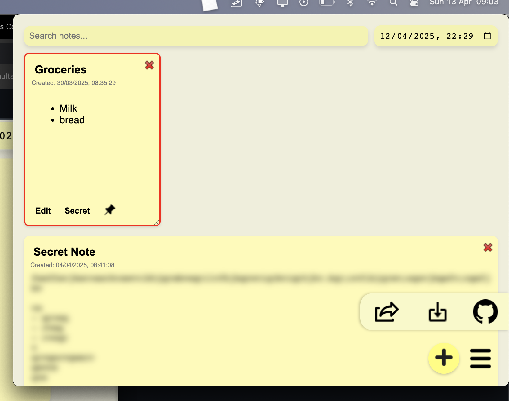

# Sticky Notes

Sticky Notes is a lightweight, cross-platform desktop application built with Electron. It offers a fast and intuitive way to create, edit, search, and manage your notes. Featuring Markdown support, auto-save, and global reminders, Sticky Notes helps you stay organized and productive—all accessible from a sleek system tray interface.



## Features

- **Create and Manage Notes:**  
  Quickly create new notes with a single click and edit titles and content in real time.
- **Markdown Support:**  
  Write your notes in Markdown and easily switch between an edit (read/write) mode and a preview (read-only) mode.
- **Your data is only yours**
  All your notes stay on your device.
- **Advanced Search and Filter:**  
  Instantly search for notes by keywords in the title, content, or tags. Features search highlighting that shows exactly where your search terms appear in notes. Includes a quick-clear button to reset search with one click.
- **Smart Tagging System:**  
  Create space-separated tags for each note (e.g., "work personal urgent"). Each tag gets a unique color for easy visual identification. Search by tag names to quickly filter related notes.
- **Auto-Save:**  
  Your changes are automatically saved to local storage, ensuring that your notes persist across sessions.
- **Dual Reminder System:**  
  Set both global app reminders and individual note reminders. When triggered, reminders automatically open the app and filter to show the relevant note instead of showing popups.
- **Per-Note Reminders:**  
  Each note can have its own reminder with a toggleable bell icon. Click the bell to show/hide reminder controls. Bell icon changes from outline to filled based on visibility state.
- **System Tray Integration:**  
  Access your notes quickly via a system tray icon, keeping your workspace uncluttered.
- **Export/Import Notes:**  
  Export your notes as JSON files through the side navigation menu. Import previously exported notes to restore or merge with existing notes.
- **Pin Notes:**  
  Pin important notes to prevent accidental deletion, giving you extra security for critical information.
- **Resizable Notes:**  
  Resize notes to your preferred dimensions. Each note remembers its size for a personalized layout.
- **Draggable Notes:**  
  Move notes around by dragging them to organize your workspace layout. Each note remembers its position for a customized arrangement.
- **Search Highlighting:**  
  When searching, matching terms are highlighted in yellow across note titles, content (in preview mode), and tags for instant visual feedback.

---

## Installation for Developers

### Steps to Set Up the Project

1. Clone the repository:
   ```bash
   git clone https://github.com/AdamKmet1997/sticky_notes.git
   cd sticky_notes
   ```
2. Install dependencies:

```bash
   npm install
```

3. Start the development server:

```bash
   grunt
```

4. To build the app:

```bash
   npm run build
```

[](https://buymeacoffee.com/adamkmet)
