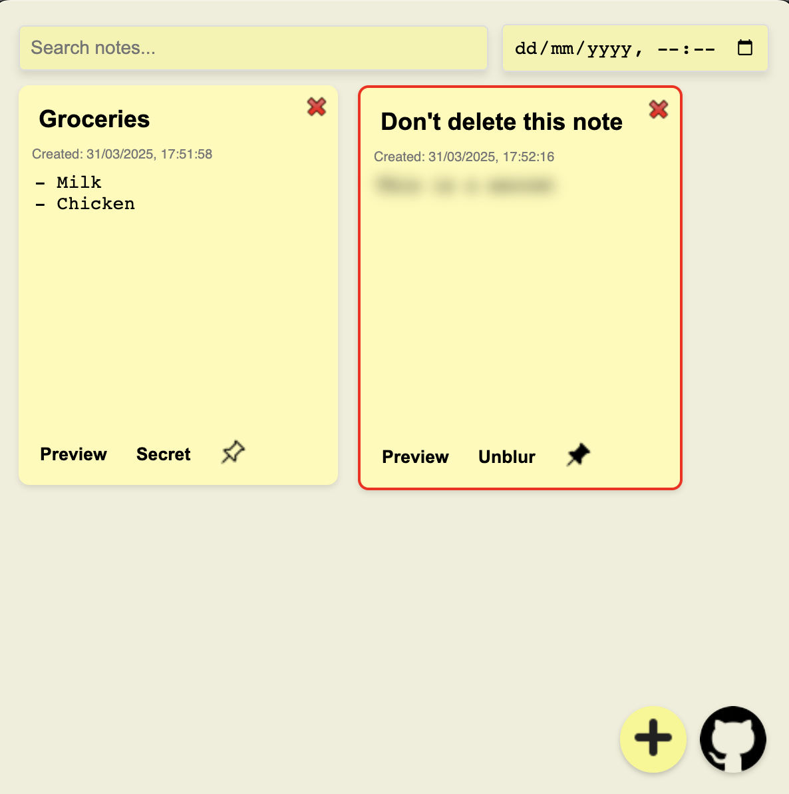

# Sticky Notes

Sticky Notes is a lightweight, cross-platform desktop application built with Electron. It offers a fast and intuitive way to create, edit, search, and manage your notes. Featuring Markdown support, auto-save, and global reminders, Sticky Notes helps you stay organized and productive—all accessible from a sleek system tray interface.




## Features

- **Create and Manage Notes:**  
  Quickly create new notes with a single click and edit titles and content in real time.
  
- **Markdown Support:**  
  Write your notes in Markdown and easily switch between an edit (read/write) mode and a preview (read-only) mode.
  
- **Search and Filter:**  
  Instantly search for notes by keywords in the title or content.
  
- **Auto-Save:**  
  Your changes are automatically saved to local storage, ensuring that your notes persist across sessions.
  
- **Global Reminders:**  
  Set a global reminder that brings your app to the forefront at a specified time.
  
- **System Tray Integration:**  
  Access your notes quickly via a system tray icon, keeping your workspace uncluttered.
  
- **Cross-Platform:**  
  Works on macOS, Windows, and Linux.

---

## Installation for Developers

If you'd like to build or contribute to Sticky Notes, follow these steps to set up your development environment:

### Prerequisites
- **Node.js** (v16 or later)
- **npm** (or **yarn**)
- **Git**

### Steps to Set Up the Project
1. Clone the repository:
   ```bash
   git clone https://github.com/AdamKmet1997/sticky_notes.git
   cd sticky_notes
   ```
2. Install dependencies:

``` bash
   npm install
```

3. Start the development server:

``` bash
   npm start
```

4. To build the app:

``` bash 
   npm run build
```