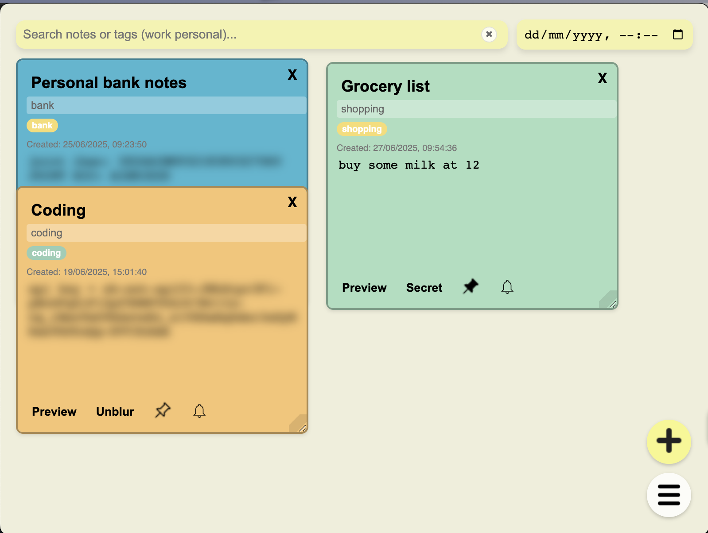

# Sticky Notes

Sticky Notes is a cross-platform desktop app built with Electron. Create freeform sticky notes on a draggable board, search and filter instantly, and get native reminders—all from the system tray.



## Features

- **Freeform board** — Drag, resize, and stack notes. Positions, sizes, colors, and z-order persist.
- **List view** — Switch to a compact list when search results pile up.
- **Markdown with live preview** — Write in Markdown and see rendered output update as you type.
- **Search and filters** — Search title, body, tags, and groups. Matching terms are highlighted; tag and group chips filter the board.
- **Groups and tags** — Organize notes with folders/groups and colored tag chips.
- **Reminders** — Per-note reminders with daily/weekly repeat, a global app reminder, native OS notifications, and a reminder inbox.
- **Templates** — Blank, to-do, and meeting note templates (dropdown or right-click **New note**).
- **Pin and lock** — Pin notes to prevent deletion; lock notes to hide content until you unlock them.
- **Screen-share blur** — Hide sensitive note text with a one-click blur.
- **Themes** — Light, dark, or follow system appearance.
- **Keyboard shortcuts** — `⌘/Ctrl+N` new note, `⌘/Ctrl+F` search, `⌘/Ctrl+P` pin focused note, `⌘/Ctrl+1/2` board/list, arrow keys to move between notes, `Esc` to clear search.
- **Undo delete** — Recover deleted notes from a toast for 8 seconds.
- **Import / export** — JSON backup with duplicate-id handling on import.
- **Tray-first access** — Frameless window with keep-open mode, tray menu, and file-backed storage in app user data (migrates legacy localStorage automatically).

Your data stays on your device.

---

## Installation for Developers

1. Clone the repository:
   ```bash
   git clone https://github.com/AdamKmet1997/sticky_notes.git
   cd sticky_notes
   ```
2. Install dependencies:
   ```bash
   npm install
   ```
3. Start the development server:
   ```bash
   grunt
   ```
4. Build the app:
   ```bash
   npm run build
   ```

[](https://buymeacoffee.com/adamkmet)
